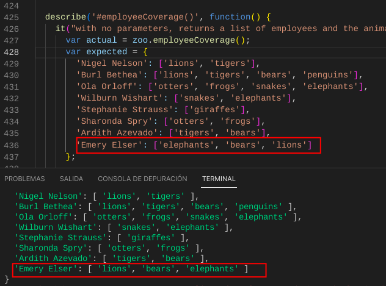
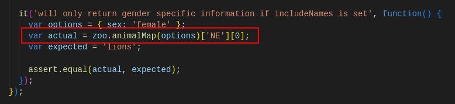

# Ejercicio 3: Puesta en pràctica la gestión de arrays y objetos

Aquí vemos unas cuantas funciones muy interesantes para el manejo de arrays
* [array.find(callback);](https://developer.mozilla.org/en-US/docs/Web/JavaScript/Reference/Global_Objects/Array/find)
* [array.some(callback);](https://developer.mozilla.org/es/docs/Web/JavaScript/Reference/Global_Objects/Array/some)
* [array.every(callback);](https://developer.mozilla.org/es/docs/Web/JavaScript/Reference/Global_Objects/Array/every)
* [array.reduce(callback);](https://developer.mozilla.org/es/docs/Web/JavaScript/Reference/Global_Objects/Array/Reduce)
* [array.map(callback);](https://developer.mozilla.org/en-US/docs/Web/JavaScript/Reference/Global_Objects/Array/map)
* [array.filter(callback);](https://developer.mozilla.org/en-US/docs/Web/JavaScript/Reference/Global_Objects/Array/filter)
* [array.foreach(callback);](https://developer.mozilla.org/es/docs/Web/JavaScript/Reference/Global_Objects/Array/forEach)

# Problemas encontrados

## Problema 1: employeeCoverage
Segun los test, los resultados han de ser identicos, sin tener en cuenta si el contenido és o no correcto, por ejemplo un cambio de orden de un array, miramos el siguiente ejemplo:

Podemos observar el error, no de contenido, sinó de orden.

## Problema 2: animalMap
Existe un apartado que no he entendido que formulación está utilizando, he visto alguna cosa en el foro peró no he sido capaz de entenderlo, dejo la mustra de la parte no entendida:

> Como anotación, decir que algunos ejemplos son muy útilies para ir entendiendo como funcionas arrays y objetos.
